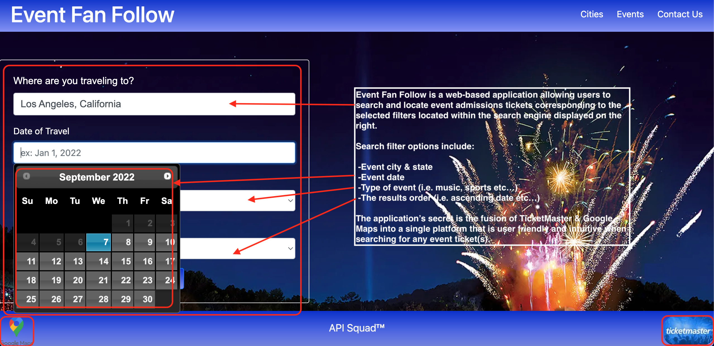
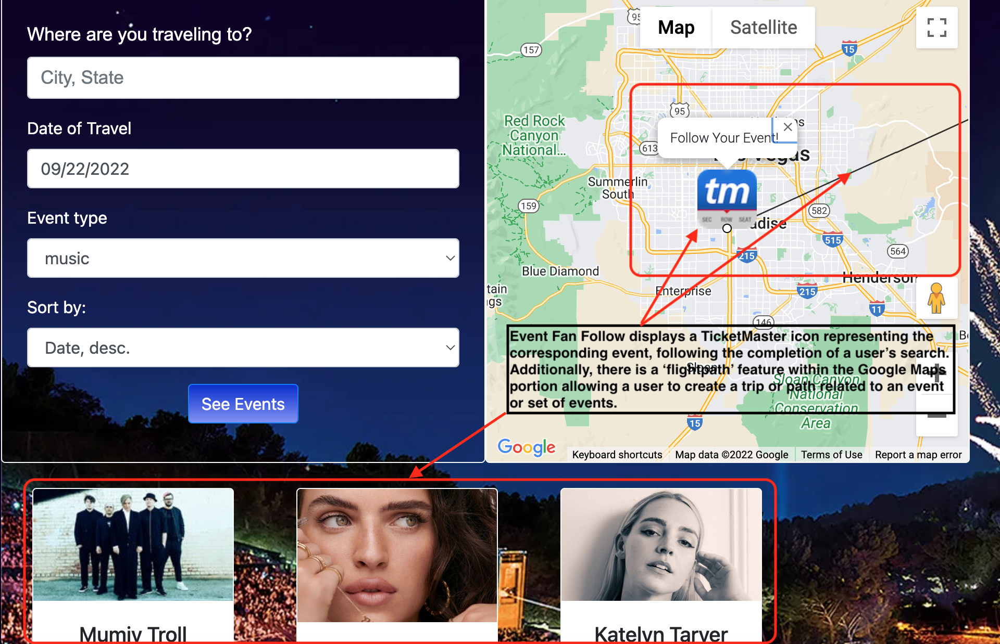
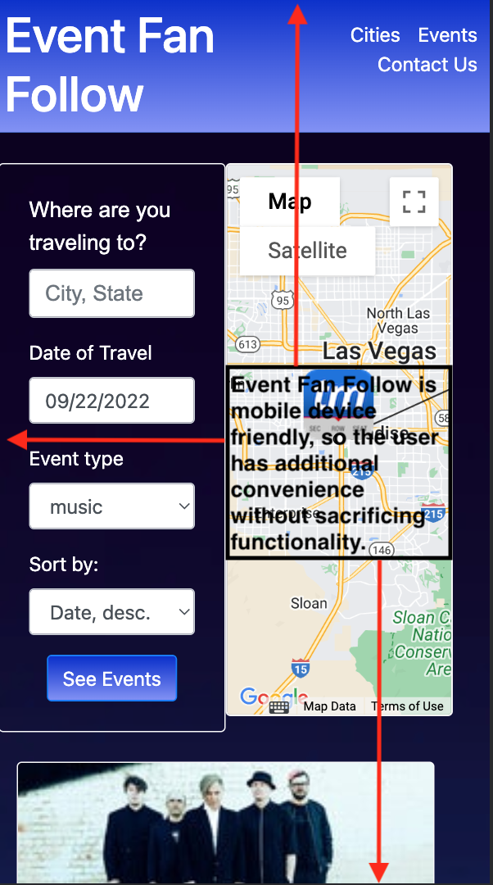

# Event-Fan-Follow

## Description 
Upon opening the application, the user is presented with a form. They can fill out the city that they’re visiting, the date, what type of event they are looking for, and they can sort by a variety of options. Once the form is complete and the events render, the user is also presented with a google map to make getting to the event a breeze.  

## Motivation for development? 
As a team comprised of avid travelers, we wanted a one-stop shop to see all events happening and how to get there. 

## User story 
- As a traveler and fan of live events
- I want access to certain events in the area that I am visiting
- So that I can experience all that the city has to offer.
## Acceptance Criteria 
- Given I am planning a trip to a new city
- When I select my destination city, date, and event type
- Then I am presented with a list of events that I can check out. 

## Technologies used 
HTML, CSS, JavaScript, JQuery, Bootstrap, Moment, Google Fonts, TicketMaster API, Google Maps API.

## Breakdown of tasks and roles 
Mallory and Todd handled the site layout and design including the navigation bar, building of the form and local storage. Arely and Aram tackled the API connections. Arely worked on the TicketMaster API and making it functional, and Aram worked on the Google Maps API, and having the map render! 

## Challenges 
Working on branches and merging into main has proven to be a challenge for API squad. Google Maps API turned out to be very finicky. 

## Successes 
The four of us worked REALLY well together! Brainstorming was fun and we came up with a few ideas, but ultimately decided on Event Fan Follow. Once we started work on the app, we delegated tasks but helped each other with road-blocks as they came up. It was exciting to see the APIs start to bring in information and see our hard work in action.

## Directions for Future Development
- create a ‘Load More’ feature and a scroll to view all events. 
- Create additional HTML pages for nav bar links - ex: contact us.  
- Options to print directions.
- Options to link and open the Google Maps app.
- Connect to Spotify to allow users to check out the artists prior to committing to event.
- Connect additional ticket APIs - ex: LiveNation or EventBrite.
- Add ability to bookmark events that you’re interested in.
- Connect to users personal calendar to save events.  
- Build in sections for advertising/sponsorship partners.

## Demo

**Note:** The following GIF and images will demonstrate the application's look and functionality:

### Main Screen:

### Google Maps:

### Mobile Device Compatibility:

### Ticket Cards:

### Deployed Webpage URL:
https://aasports89.github.io/Event-Fan-Follow/

### Deployed Webpage URL:
https://github.com/AASports89/Event-Fan-Follow
